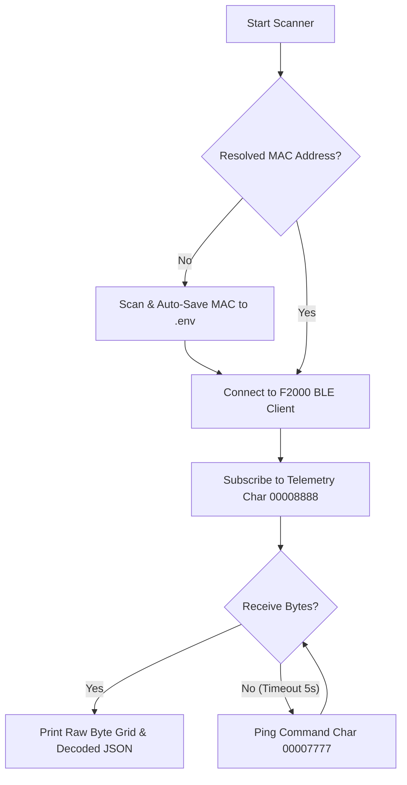

# 🔋 Anker Solix F2000 Home Assistant BLE Integration

A premium, cloud-free custom HACS integration for the **Anker Solix F2000 (PowerHouse 767)** portable power station, operating completely locally via Bluetooth Low Energy (BLE).

This repository contains local testing CLI verification scripts, diagnostic GATT utilities, and technical specification guidelines to verify telemetry streams before integration scaffolding.

> [!NOTE]
> This integration leverages local BLE advertising, bypassing latency, internet dependencies, and cloud API limits, enabling a fully cloud-free smart home dashboard.

---

## 🏗️ Architecture & Communication Flow

The F2000 power station broadcasts unencrypted telemetry bytes on a custom notification characteristic and receives keep-alive pings on a write-without-response characteristic.



---

## ⏰ The Bluetooth Timeout Problem

> [!WARNING]
> The Anker Solix F2000 has a frustrating firmware behaviour: if no Bluetooth connection is active for **12 hours**, the device **silently disables its Bluetooth radio** to "save power." This forces you to physically walk over to the unit and press the Bluetooth button every single day to re-enable it.
>
> Yes — Anker decided to kill Bluetooth to save milliwatts on a device with a **2,048 Wh (2 kWh)** battery capacity.

This integration solves the problem permanently:

| Without Integration | With Integration |
|---|---|
| BLE radio shuts off after 12h of inactivity | **Always on** — 30-second active polling keeps the connection alive |
| Must physically press the BT button daily | Fully automated, zero manual intervention |
| No real-time telemetry in Home Assistant | Live battery, power, and temperature sensors |

> [!TIP]
> By issuing a telemetry query command every 30 seconds, the coordinator keeps the BLE radio awake indefinitely while simultaneously providing real-time sensor data to Home Assistant. The F2000 never enters Bluetooth sleep.

---

## 🛠️ Getting Started & Virtual Environment Setup

To run the verification scripts and test local telemetry safely, configure an isolated Python 3.11 virtual environment under `test-scripts/`.

### 1. Initialize Virtual Environment
Navigate to your workspace and create the virtual environment:
```bash
# Create venv using Python 3.11
python3.11 -m venv test-scripts/venv

# Activate the virtual environment
source test-scripts/venv/bin/activate
```

### 2. Install Required Dependencies
Install the required packages (`bleak` for BLE connectivity and `SolixBLE` for structured parsing):
```bash
pip install -r test-scripts/requirements.txt
```

---

## ⚙️ Configuration (`.env`)

To protect your local hardware parameters from being leaked in public repositories, they are safely loaded from a Git-ignored `.env` file at the root.

Create a `.env` file at the root:
```ini
# Private Local Hardware Parameters (Git-Ignored)
ANKER_MAC_ADDRESS=XX:XX:XX:XX:XX:XX  # Your Anker BLE MAC Address
ANKER_DEVICE_NAME=767_PowerHouse
```

---

## 🔍 Running Verification Scripts

### A. BLE Device Scanning & Auto-Configuration
To scan for nearby Anker devices and automatically configure your local `.env` file, place your F2000 in active Bluetooth pairing mode (press the physical IoT/Bluetooth button on the front of the unit once so that the Bluetooth symbol begins blinking) and run:
```bash
test-scripts/venv/bin/python test-scripts/test_passive_telemetry.py --scan
```
> [!TIP]
> Once a candidate is discovered, the script will register its BLE MAC address and name inside your `.env` file and exit cleanly. Subsequent commands (diagnostics, telemetry, and heartbeats) read from this file and run parameter-free!


### B. GATT Database Diagnostics
Inspect the service GATT structure to confirm the device characteristics (reads MAC from the configured `.env` file):
```bash
test-scripts/venv/bin/python test-scripts/diagnose_gatt.py
```

### C. Streaming Decoded Passive Telemetry
Subscribe to telemetry notifications, parse the unencrypted 102-byte packets continuously, and print a formatted real-time dashboard:
```bash
test-scripts/venv/bin/python test-scripts/test_passive_telemetry.py
```

### D. Verifying Heartbeats & Connection Persistence
Test active 5-minute heartbeats to verify connection persistence and BLE radio sleep prevention:
```bash
test-scripts/venv/bin/python test-scripts/test_heartbeat.py
```

### E. Running Automated Unit Tests
To execute the comprehensive mock telemetry validation unit tests using `pytest` inside the local virtual environment:
```bash
test-scripts/venv/bin/pytest
```
> [!NOTE]
> This command runs `test-scripts/test_mock_telemetry.py` to assert correct byte extraction, register scaling, and checksum validation against the mock F2000 hardware state machine without requiring a physical BLE connection.

---

## 🛍️ Installation via HACS (Home Assistant Community Store)

You can easily install this integration into your Home Assistant environment via HACS as a **Custom Repository**. This delivers simple plug-and-play installation and keeps the component up to date.

### 1. Add Custom Repository to HACS
1. Open your Home Assistant UI and navigate to **HACS** → **Integrations**.
2. Click the three dots `⋮` in the top right corner and select **Custom repositories**.
3. Under **Repository**, enter the GitHub URL of this repository:
   ```text
   https://github.com/yunseokoh/ha-anker-solix-f2000
   ```
4. Under **Category**, select **Integration** and click **Add**.

### 2. Download the Integration
1. Click **+ Explore & Download Repositories** in the bottom right corner of HACS.
2. Search for **"Anker Solix F2000"** and select it.
3. Click **Download** in the bottom right corner and select the latest release version.
4. **Restart Home Assistant** to load the custom component files.

### 3. Configure the Integration in Home Assistant
1. Navigate to **Settings** → **Devices & Services** → **Add Integration**.
2. Search for **"Anker Solix F2000"** and select it.
3. If using an ESPHome Bluetooth Proxy (or if running on a native Bluetooth host), the config flow will **automatically scan and discover** your F2000 device. Select it from the list.
4. If no device is discovered, select **"Manually Enter MAC Address..."** and input your device's BLE MAC address.

### ⚙️ Options & Dynamic Telemetry Polling Configuration
Once configured, you can click **Configure** on the integration card at any time to dynamically customize performance parameters:
*   **Active Polling Interval**: Change how frequently Home Assistant queries the F2000 for telemetry. Selectable between **5 seconds** (for real-time power tracking) and **30 seconds** (default: 5 seconds).
*   **Maximum Reconnection Delay**: Configure the maximum retry limit for the exponential back-off recovery loop if the connection is temporarily occupied by the official mobile app. Selectable between **30 seconds** and **300 seconds** (default: 30 seconds).

All options apply **instantly** without requiring an integration restart.

---

## 🐳 Deploying Home Assistant with Docker

This repository includes a pre-configured `docker-compose.yml` to package and run a local Home Assistant stable instance for dynamic custom component integration testing.

### 1. Spin Up Local Home Assistant
To spin up a local Home Assistant stable instance with our custom component dynamically mapped:
```bash
# Spin up Home Assistant in the background
docker compose up -d homeassistant
```
*   **Web Portal**: Access your local Home Assistant UI at [http://localhost:8123](http://localhost:8123).
*   **Active Scaffolding**: Any modifications made to `custom_components/anker_solix_f2000/` are instantly shared with the container and can be dynamically reloaded from the Home Assistant UI without rebuilding.

### 🛜 Host Bluetooth & OS Compatibility Guidelines
To ensure Home Assistant can discover and connect to your physical Anker F2000 unit over BLE inside Docker, note the following system requirements:

*   **Linux Hosts**: 
    *   The container uses **Host Networking** (`network_mode: host`) to directly bind to physical Bluetooth controllers.
    *   It mounts the **System D-Bus Socket** (`/var/run/dbus:/var/run/dbus:ro`) to communicate with the host's `bluez` Bluetooth system daemon. Ensure `dbus` is active on your host.
*   **macOS Hosts**: 
    *   > [!WARNING]
    *   > Docker on macOS runs inside a Linux virtual machine hypervisor. Because macOS does not support passing CoreBluetooth hardware controllers through to hypervisor guests, **Home Assistant running in Docker on macOS cannot access physical Bluetooth adapters**.
    *   👉 **Action**: To test real BLE operations (scanning, streaming, heartbeats) or to run `pytest` unit tests on macOS, execute the local Python CLI verification scripts or `pytest` directly on your host machine inside the local virtual environment (`test-scripts/venv/`).

---

## ⚠️ Troubleshooting & macOS Bluetooth Caching

Operating Bluetooth integrations on macOS can sometimes encounter system-level locking. Follow these guidelines to resolve connection drops:

*   **Exclusive Connection Lockout**: Anker devices only support **one active BLE client**. Ensure the **official Anker mobile app is completely force-closed** to prevent link lockouts.
*   **System Pairing/Bonding**: macOS will silently drop notification packet streams if secure pairing is not finalized.
    *   👉 **Action**: Press the physical **IoT button** on the front of the F2000 once to put it in active advertising mode.
*   **Resetting Caches**: If macOS aggressively caches old GATT profiles:
    *   Turn Bluetooth off and on in System Settings.
    *   "Forget" the peripheral in macOS Bluetooth Settings.
    *   Restart the system Bluetooth daemon: `sudo pkill bluetoothd`
