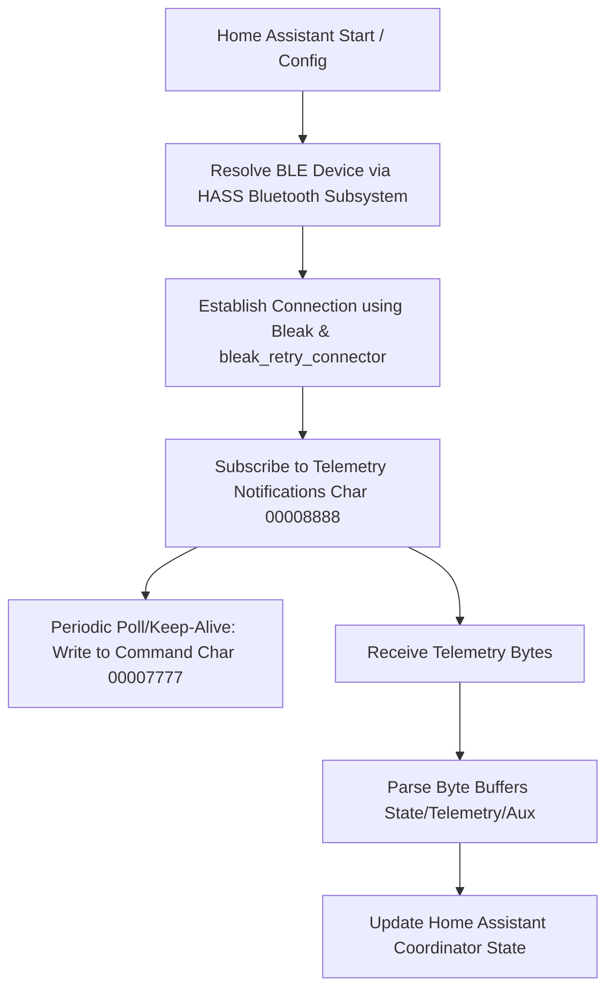

# 🔋 Anker Solix F2000 Home Assistant BLE Integration

A premium, cloud-free custom HACS integration for the **Anker Solix F2000 (PowerHouse 767)** portable power station, operating completely locally via Bluetooth Low Energy (BLE).

[](https://github.com/hacs/integration)
[](https://my.home-assistant.io/redirect/hacs_repository/?owner=yun-s-oh&repository=ha-anker-solix-f2000&category=integration)
[](https://my.home-assistant.io/redirect/config_flow_start/?domain=anker_solix_f2000)

> [!NOTE]
> This integration leverages unencrypted local BLE notifications, bypassing latency,
> internet dependencies, and cloud API limits, enabling a fully local smart home dashboard.

> [!IMPORTANT]
> **Exclusive Bluetooth Connection Lockout**: The Anker Solix F2000 only supports
> **one active Bluetooth connection** at a time. Because this integration maintains
> a persistent BLE connection to keep the station's Bluetooth radio active and poll
> telemetry, **you cannot use the official Anker mobile app to connect to the F2000
> while this integration is active**. The app must be fully closed/terminated on
> all devices for the integration to function.

---

## 🏗️ Architecture & Communication Flow

This integration is built around Home Assistant's native Bluetooth subsystem and
updates its state entities asynchronously using a central `DataUpdateCoordinator`.



The integration manages a persistent BLE connection using `bleak_retry_connector` to
ensure automatic reconnection after dropouts. It subscribes to notification updates
on characteristic `00008888` and writes a keep-alive telemetry query to
characteristic `00007777` at the user-configured polling interval.

---

## ⏰ The Bluetooth Timeout Problem (Mitigation)

> [!WARNING]
> The Anker Solix F2000 shuts off its Bluetooth radio after **12 hours** of inactivity or when the battery is fully drained. Once this occurs, it will require manual reactivation (physically pressing the IoT/Bluetooth button on the unit).

This integration solves this problem permanently:

| Without Integration | With Integration |
|---|---|
| BLE radio shuts off after 12h of inactivity | **Always active** — Continuous active polling keeps the connection alive |
| Must physically press the BT button daily | Fully automated, zero manual intervention |
| No real-time telemetry in Home Assistant | Live battery, power, temperature, and port status sensors |

> [!TIP]
> By querying the peripheral every few seconds, the coordinator keeps the BLE radio active indefinitely while providing real-time telemetry to Home Assistant.

---

## 🚀 Key Features

* **100% Offline & Local**: Zero cloud dependencies or internet access required.
* **Unified Battery Indicator**: Automatically maps `total_pct` to `"Battery"`, allowing HASS to natively display your power station's state of charge next to the integration card logo.
* **Dynamic Expansion Isolation**: Automatically detects physical expansion battery connectivity
  and isolates metrics (`external_pct`, `external_temp_c`), reporting `None` when disconnected
  to prevent empty slots from skewing system-level status.
* **Setup-Level Polling Options**: Enter active polling intervals (5s–300s) and
  reconnection ceiling parameters directly inside the initial configuration setup step.
* **Embedded Brand Assets**: Polished custom high-resolution icons and logos packaged offline inside `brand/` for native dashboard styling.

---

## ⚙️ Configuration Options

After installation, the integration can be configured during initial setup or customized later via HASS Options:

| Setting Name | Schema Key | Allowed Range | Default | Description |
|---|---|---|---|---|
| **MAC Address** | `address` | XX:XX:XX:XX:XX:XX | N/A | Target physical BLE MAC address or macOS UUID |
| **Integration Name** | `name` | String | `767_PowerHouse` | Friendly name for the device registry |
| **Active Polling Rate** | `poll_interval` | `5` to `300` seconds | `30` | Active query poll frequency |
| **Reconnection Delay** | `max_retry_interval` | `30` to `600` seconds | `60` | Maximum retry limit |

---

## 📊 Exposed Platforms & Entities

The F2000 BLE integration exposes a wide selection of telemetry sensors:

### Sensor Platform (`sensor`)

| Entity Name | Key | Device Class | Unit | Category | Description |
|---|---|---|---|---|---|
| **Battery** | `total_pct` | `battery` | `%` | None (Badge) | Main battery State of Charge |
| **Internal Battery** | `internal_pct` | `battery` | `%` | None | Internal battery capacity |
| **External Battery Expansion** | `external_pct` | `battery` | `%` | None | Expansion capacity |
| **Battery Operating State** | `battery_state` | None | None | None | Current state (Idle, Discharging, Charging) |
| **Battery Runtime Remaining** | `battery_remaining_minutes` | `duration` | `min` | None | Calculated operating minutes remaining |
| **Internal Battery Temperature** | `internal_temp_c` | `temperature` | `°C` | None | Temperature of the main internal battery |
| **External Battery Temperature** | `external_temp_c` | `temperature` | `°C` | None | Temperature of the expansion battery |
| **AC Input Power** | `ac_input_w` | `power` | `W` | None | Power imported from grid AC |
| **Solar Input Power** | `solar_input_w` | `power` | `W` | None | Power imported from solar PV |
| **Total Input Power** | `total_input_w` | `power` | `W` | None | Combined input load |
| **AC Outlet Power Output** | `ac_outlet_w` | `power` | `W` | None | Load consumed by active AC outlets |
| **Total Output Power** | `total_output_w` | `power` | `W` | None | Combined output load |
| **USB-C Port 1 Power** | `usb_c1_w` | `power` | `W` | None | Load consumed by USB-C Port 1 |
| **USB-C Port 2 Power** | `usb_c2_w` | `power` | `W` | None | Load consumed by USB-C Port 2 |
| **USB-C Port 3 Power** | `usb_c3_w` | `power` | `W` | None | Load consumed by USB-C Port 3 |
| **USB-A Port 1 Power** | `usb_a1_w` | `power` | `W` | None | Load consumed by USB-A Port 1 |
| **USB-A Port 2 Power** | `usb_a2_w` | `power` | `W` | None | Load consumed by USB-A Port 2 |
| **12V Car Port 1 Power** | `dc_12v_port1_w` | `power` | `W` | None | Load consumed by Car Port 1 |
| **12V Car Port 2 Power** | `dc_12v_port2_w` | `power` | `W` | None | Load consumed by Car Port 2 |
| **12V Car Port Timer** | `dc_12v_port1_timer` | `duration` | `s` | None | Car port timer |
| **AC Sockets Timer** | `ac_outlet_timer` | `duration` | `s` | None | AC sockets timer |

### Binary Sensor Platform (`binary_sensor`)

| Entity Name | Key | Device Class | Category | Description |
|---|---|---|---|---|
| **AC Sockets Power State** | `ac_outlet_on` | `running` | None | `True` when AC sockets are active |
| **12V Car Port 1 Switch State** | `dc_12v_port1_on` | `running` | None | `True` when Car Port 1 is active |
| **12V Car Port 2 Switch State** | `dc_12v_port2_on` | `running` | None | `True` when Car Port 2 is active |
| **USB-C Port 1 Switch State** | `usb_c1_on` | `running` | None | `True` when USB-C Port 1 is active |
| **USB-C Port 2 Switch State** | `usb_c2_on` | `running` | None | `True` when USB-C Port 2 is active |
| **USB-C Port 3 Switch State** | `usb_c3_on` | `running` | None | `True` when USB-C Port 3 is active |
| **USB-A Port 1 Switch State** | `usb_a1_on` | `running` | None | `True` when USB-A Port 1 is active |
| **USB-A Port 2 Switch State** | `usb_a2_on` | `running` | None | `True` when USB-A Port 2 is active |

### Switch Platform (`switch`)

| Entity Name | Key | Icon | Category | Description |
|---|---|---|---|---|
| **AC Sockets Master** | `ac_outlet_on` | `mdi:power-socket-us` | None | Controls AC outlets |
| **12V Car Port Master** | `twelve_volt_on` | `mdi:car-electric` | None | Controls 12V port |
| **Power Saving Mode** | `power_save_on` | `mdi:sprout` | None | Toggles Power Saving mode |

### Select Platform (`select`)

| Entity Name | Key | Options | Icon | Description |
|---|---|---|---|---|
| **LED Light Brightness** | `led_state` | OFF, LOW, MID, HIGH, SOS | `mdi:led-on` | LED brightness level |
| **Screen Brightness** | `screen_brightness` | Low, Mid, High, Max | `mdi:brightness-6` | LCD brightness |
| **Screen Timeout** | `screen_timeout` | 20s, 30s, 1m, 5m, 30m | `mdi:progress-clock` | LCD screen timeout |
| **AC Shutdown Timer** | `ac_outlet_timer` | Disabled, 5m-18h | `mdi:timer-outline` | AC timer |
| **DC Shutdown Timer** | `dc_12v_port1_timer` | Disabled, 5m-18h | `mdi:timer-outline` | DC timer |

### Number Platform (`number`)

| Entity Name | Key | Range / Step | Unit | Description |
|---|---|---|---|---|
| **AC Recharge Limit** | `ac_recharging_power` | 200-2200 / 100 | W | AC charge limit |

---

## 🧪 Standalone CLI Verification & Testing Suite

An isolated Python testing and validation suite is housed under `tests/` to safely query telemetry, probe peripheral structures, and execute unit tests completely independent of Home Assistant.

For detailed instructions on initial setup, hardware configuration, validation scripts, and diagnostic tools, please refer to the dedicated [tests/README.md](/tests/README.md).

---

## 🐳 Running Home Assistant Locally (Docker Compose)

Scaffold a local testing container mapping custom components dynamically:
```bash
# Start Home Assistant in host networking mode
docker compose up -d homeassistant
```
Access the local web portal at [http://localhost:8123](http://localhost:8123).

---

## ⚠️ Troubleshooting & macOS Bluetooth Guidelines

* **Exclusive Connection Lockout**: Anker units support **only one active Bluetooth connection**. Completely force-close the official Anker app on all mobile devices before connecting Home Assistant.
* **macOS Host Limitations**: Hypervisors running Docker on macOS cannot pass physical
  Bluetooth controllers. Run unit tests and verification CLI scripts natively inside your macOS
  host's Python virtual environment (`tests/venv/`) synced via `uv` to allow CoreBluetooth access.
* **macOS Caching Issues**: If peripheral structures become unresponsive, toggle your Bluetooth radio off/on in System Settings, or reset the local daemon:
  ```bash
  sudo pkill bluetoothd
  ```
