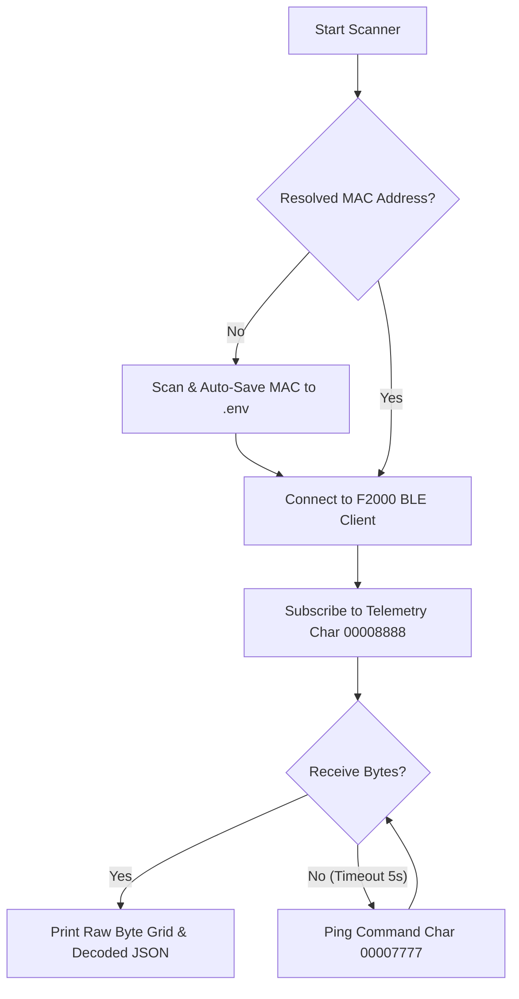

# 🔋 Anker Solix F2000 Home Assistant BLE Integration

A premium, cloud-free custom HACS integration for the **Anker Solix F2000 (PowerHouse 767)** portable power station, operating completely locally via Bluetooth Low Energy (BLE).

This repository contains local testing CLI verification scripts, diagnostic GATT utilities, and technical specification guidelines to verify telemetry streams before integration scaffolding.

> [!NOTE]
> This integration leverages local BLE advertising, bypassing latency, internet dependencies, and cloud API limits, enabling a fully cloud-free smart home dashboard.

---

## 🏗️ Architecture & Communication Flow

The F2000 power station broadcasts unencrypted telemetry bytes on a custom notification characteristic and receives keep-alive pings on a write-without-response characteristic.



---

## 🛠️ Getting Started & Virtual Environment Setup

To run the verification scripts and test local telemetry safely, configure an isolated Python 3.11 virtual environment under `test-scripts/`.

### 1. Initialize Virtual Environment
Navigate to your workspace and create the virtual environment:
```bash
# Create venv using Python 3.11
python3.11 -m venv test-scripts/venv

# Activate the virtual environment
source test-scripts/venv/bin/activate
```

### 2. Install Required Dependencies
Install the required packages (`bleak` for BLE connectivity and `SolixBLE` for structured parsing):
```bash
pip install -r test-scripts/requirements.txt
```

---

## ⚙️ Configuration (`.env`)

To protect your local hardware parameters from being leaked in public repositories, they are safely loaded from a Git-ignored `.env` file at the root.

Create a `.env` file at the root:
```ini
# Private Local Hardware Parameters (Git-Ignored)
ANKER_MAC_ADDRESS=XX:XX:XX:XX:XX:XX  # Your Anker BLE MAC Address
ANKER_DEVICE_NAME=767_PowerHouse
```

---

## 🔍 Running Verification Scripts

### A. GATT Database Diagnostics
Inspect the service GATT structure to confirm the device characteristics:
```bash
test-scripts/venv/bin/python test-scripts/diagnose_gatt.py
```

### B. BLE Device Scanning & Auto-Configuration
To scan for nearby Anker devices and automatically configure your `.env` file on the first run:
```bash
test-scripts/venv/bin/python test-scripts/test_telemetry.py --scan
```
> [!TIP]
> If a potential Anker Solix candidate is found, the script will automatically register its BLE MAC address and name inside your `.env` file, meaning subsequent commands run parameter-free!

### C. Streaming Raw Telemetry & Register Discovery
Subscribe to raw telemetry streams, print a beautiful visual byte matrix, and decode the power/battery registers:
```bash
test-scripts/venv/bin/python test-scripts/test_raw_telemetry.py
```

---

## ⚠️ Troubleshooting & macOS Bluetooth Caching

Operating Bluetooth integrations on macOS can sometimes encounter system-level locking. Follow these guidelines to resolve connection drops:

*   **Exclusive Connection Lockout**: Anker devices only support **one active BLE client**. Ensure the **official Anker mobile app is completely force-closed** to prevent link lockouts.
*   **System Pairing/Bonding**: macOS will silently drop notification packet streams if secure pairing is not finalized.
    *   👉 **Action**: Press the physical **IoT button** on the front of the F2000 once to put it in active advertising mode.
*   **Resetting Caches**: If macOS aggressively caches old GATT profiles:
    *   Turn Bluetooth off and on in System Settings.
    *   "Forget" the peripheral in macOS Bluetooth Settings.
    *   Restart the system Bluetooth daemon: `sudo pkill bluetoothd`
