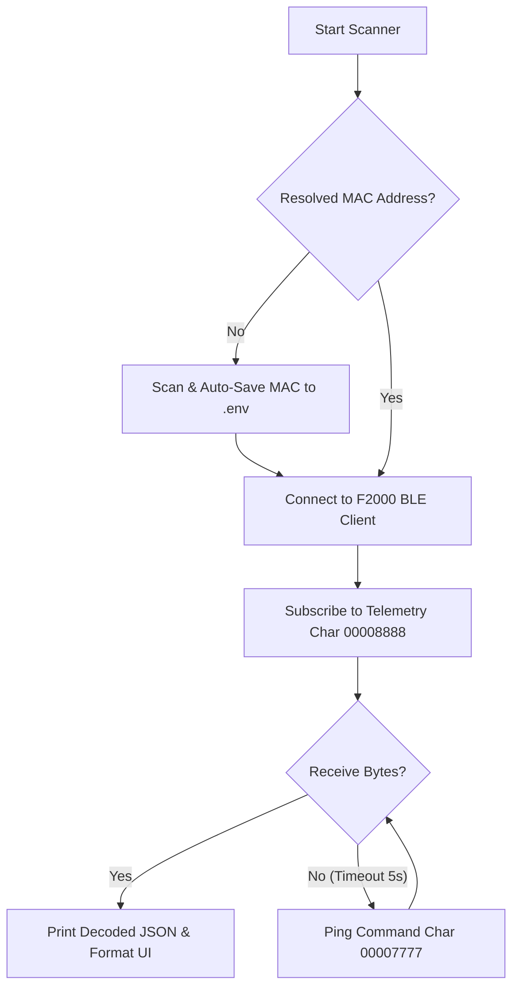

# 🧪 Standalone BLE Verification & Testing Suite

This directory contains standalone Python utility scripts to explore, discover, sniff,
and programmatically validate unencrypted Bluetooth Low Energy (BLE) controls and
telemetry schemas for the Anker Solix F2000 (PowerHouse 767) portable power station.

These scripts run natively on the host system to interact directly with CoreBluetooth
(on macOS) or BlueZ (on Linux), enabling quick exploration and validation without
requiring a full Home Assistant installation.

---

## 🏗️ CLI Architecture & Communication Flow

The standalone CLI scripts (e.g., `explore_controls.py`, `test_passive_telemetry.py`)
communicate with the F2000 power station using the following logic:



The F2000 power station broadcasts unencrypted telemetry bytes on the notification
characteristic `00008888` and receives keep-alive queries or control commands on
the write-without-response characteristic `00007777`. When running a test script,
the scanner resolves the target BLE MAC address (auto-discovering the nearby device
if none is configured) and automatically saves it to the root `.env` file for
subsequent executions.

---

## ⚙️ Initial Setup

### 1. Initialize Virtual Environment & Dependencies
All script dependencies are securely locked with hashes in `uv.lock` at the root. Initialize
and synchronize the virtual environment (`tests/venv`) with the locked dependency tree:
```bash
# Synchronize and provision the virtual environment using the lockfile
UV_PROJECT_ENVIRONMENT=tests/venv uv sync

# Activate the virtual environment
source tests/venv/bin/activate
```

### 2. Configure Local Hardware Parameters (`.env`)
Create a `.env` file at the root of the project:
```ini
# Private Local Hardware Parameters (Git-Ignored)
ANKER_MAC_ADDRESS=XX:XX:XX:XX:XX:XX  # Target BLE MAC Address / macOS UUID
ANKER_DEVICE_NAME=767_PowerHouse
```

---

## 🛠️ Testing & Validation Scripts

### 1. Interactive Explorer & Sniffer (`explore_controls.py`)
An interactive CLI console menu to send raw hex payloads or predefined presets (AC/DC toggles,
LED, Screen Brightness/Timeout, Recharging Power, and Output Shutdown Timers) and sniff
incoming notifications in a clean hex-grid format.
```bash
tests/venv/bin/python tests/explore_controls.py
```

### 2. Output Shutdown Timers Validator (`validate_timers.py`)
Programmatically verifies Task 1.4.8 (AC Output Timer) and Task 1.4.9 (DC Output Timer). It ensures
ports are active, sets timers to 10 minutes, verifies command ACKs, tracks count-down,
and resets timers back to 0.
```bash
tests/venv/bin/python tests/validate_timers.py
```

### 3. AC/DC Output Toggle Validator (`validate_ac_dc.py`)
Verifies unencrypted AC (0x86) and DC (0x87) toggle commands, tracking immediate State ACK
changes.
```bash
tests/venv/bin/python tests/validate_ac_dc.py
```

### 4. LED Brightness Level Validator (`validate_led.py`)
Verifies LED Light utility states (Off, Low, Mid, High, SOS) via command 0x8B.
```bash
tests/venv/bin/python tests/validate_led.py
```

### 5. Power Saving Mode Validator (`validate_power_save.py`)
Verifies Power Saving Mode toggle (0x8A) and monitors active State ACK transitions.
```bash
tests/venv/bin/python tests/validate_power_save.py
```

### 6. Screen Brightness Validator (`validate_screen_brightness.py`)
Verifies Screen Brightness adjustments (Low, Mid, High, Max) via command 0x88.
```bash
tests/venv/bin/python tests/validate_screen_brightness.py
```

### 7. Screen Timeout Validator (`validate_screen_timeout.py`)
Verifies Screen Timeout selections (20s, 30s, 1m, 5m, 30m) via command 0x82.
```bash
tests/venv/bin/python tests/validate_screen_timeout.py
```

### 8. AC Recharging Power Limit Validator (`validate_recharge_power.py`)
Verifies setting the AC Recharging limit (200W - 2200W) via command 0x80.
```bash
tests/venv/bin/python tests/validate_recharge_power.py
```

### 9. Switch Toggle Guard & Power Save Validator (`validate_toggle_guard.py`)
Validates that AC/DC commands behave as hardware toggles, and diagnoses Power Save sensitivity to deferred active telemetry queries.
```bash
tests/venv/bin/python tests/validate_toggle_guard.py
```

---

## 🔬 Diagnostic & Utility Tools

* **Passive Telemetry Streamer (`test_passive_telemetry.py`)**: Subscribes and parses real-time
  telemetry data. Run with `--scan` to auto-discover nearby F2000 devices, or add the `--raw` flag
  to dump the raw hex byte grid side-by-side with the decoded metrics.
* **GATT Service Dumper (`diagnose_gatt.py`)**: Discovers and logs physical BLE GATT services,
  descriptors, and properties.
* **Heartbeat Verification (`test_heartbeat.py`)**: Tests unencrypted query keep-alive ping.
* **Settings Comparison Helper (`compare_settings.py`)**: Connects to the F2000 to save and compare telemetry binary output frames to identify register indices that change when settings (like Screen Timeout) are adjusted.
* **Exhaustive Recharging limit protocol discovery script (`discover_recharge_exhaustive.py`)**: Connects to the F2000 and tests multiple command IDs (0x80 to 0x90) and payload formats to find the correct unencrypted write command for setting the AC Recharging Power Limit.
* **Screen Timeout protocol discovery script (`discover_timeout_protocol.py`)**: Connects to the F2000 and tests candidate command packet formats against real-time telemetry changes to resolve the unencrypted write command for Screen Timeout.
* **Mock F2000 packet generator and parser (`mock_f2000.py`)**: Simulates the F2000 BLE protocol packet generation and parsing to support offline unit tests.
* **Display Settings sniffer (`sniff_display_settings.py`)**: Sniffs and parses display settings from BLE characteristics.
* **Pytest Unit Tests (`test_mock_telemetry.py`)**: Offline verification of correct byte parsing,
  scaling, and coordinator coordination without a physical BLE connection. Asserts correct byte
  scaling, offset calculation, and dynamic coordinator rescheduling logic. Run via:
  ```bash
  tests/venv/bin/pytest tests/
  ```
